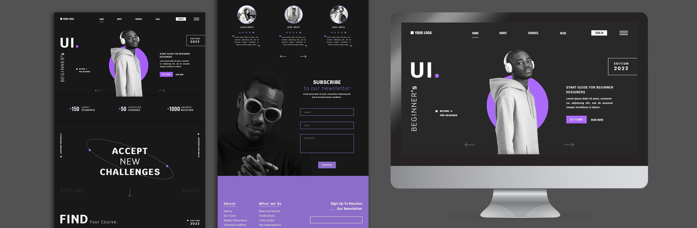

  <h1>Web Design Playground</h1>
  

  Image by <a href="https://www.freepik.com/free-psd/user-interface-design-website-template_20548064.htm#&position=10&from_view=collections">Freepik</a>

Web design code snippets, examples, design experiments, proof-of-concepts, etc

## See Online Demos

Some selected demos:

## 1. Basic Web Design

### [1.1. HTML, CSS, JS](https://github.com/abeerration/Web-Design-Playground/tree/main/demos/1.%20Basic%20Web%20Design/1.1.%20HTML%2C%20CSS%2C%20JS)

### [1.2. Box Model, Pseudo Selectors](https://abeerration.github.io/Web-Design-Playground/demos/1.%20Basic%20Web%20Design/1.2.%20Box%20Model,%20Pseudo%20Selectors)

### [1.3. Three Boxes](https://abeerration.github.io/Web-Design-Playground/demos/1.%20Basic%20Web%20Design/1.3.%20Three%20Boxes)

### [1.4. Positioning](https://abeerration.github.io/Web-Design-Playground/demos/1.%20Basic%20Web%20Design/1.4.%20Positioning)

### [1.5. Musique Complete Page Design](https://abeerration.github.io/Web-Design-Playground/demos/1.%20Basic%20Web%20Design/1.5.%20Musique%20Complete%20Page%20Design)

